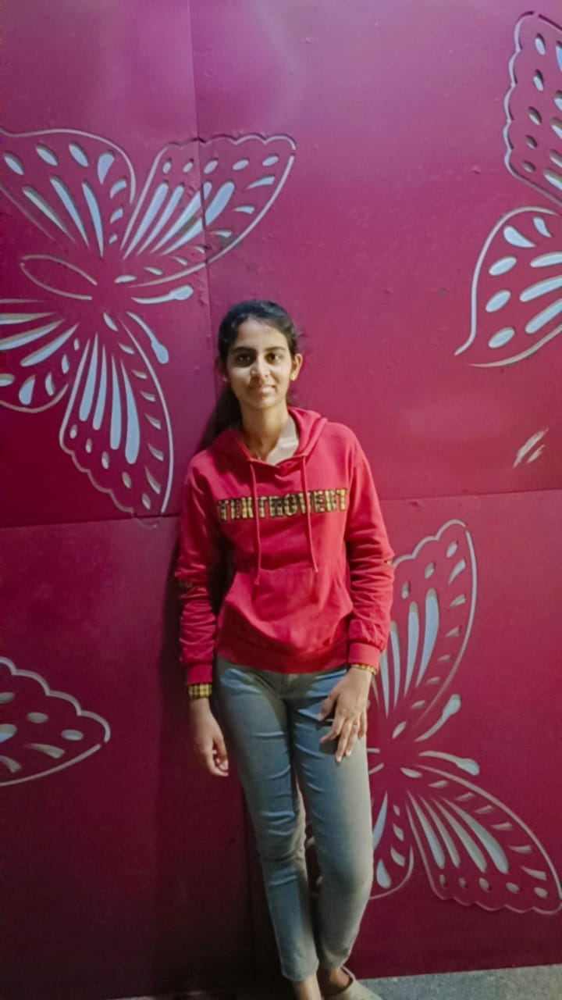

# Navyachinta.github.io

Navya chinta | IIT Goa 
 
 * [About me](#)
 * [Education](#education)
 * [Course @IIT Goa](course@iitgoa)
 * [Hobbies and interest](interests)
 
 # About me 
 
 

-  I am a college student currently in first year Mathematics and computing Branch at IIT Goa.
-  I am from Vishakapatanam located in Andhra pradesh.
-  I am passionate about  Mathematics after my graduation i will focus on mathematics.
- currently working on a project named "Rainwater Harvesting "
- In few days i am going to work on anothe project based on web development

# Education
-----------

| Academic year | class   | Institute name  | country |
|---------------|---------|-----------------|---------|
| 2022- 2026    | B.Tech. | IIT Goa         | India   |
|2020-2022      | 11 , 12 | Narayana college|India    |
|2018-2020      |  9, 10  |Narayana school  | India   |

# Course @IIT Goa

* **MA103**   Ordinary differential equations   *Dr. Saumya Bajpai*       
* **BIO101**  Introductory Biology   *Dr. Sreenath Balakrishnan,Dr. Nipa Chongdar*       
* **NO102**   National Sports Organisation  *santosh kumar*
* **PH102**   Electricity and Magnetism      *Dr. Santosh Kumar,Dr. Vaibhav Wasnik*           
*  **ME102**   Engineering Graphics and Introduction to Computer -Aided-Drawing   *Dr. Arindam Das*         
*  **EE101**   Introduction to Electrical and Electronics Engineering      *Dr. Bidhan Pramanick,Dr. Apeksha Madhukar*      
*  **CS102**   Software Tools       *Dr.Clint Pazhayidam George*        
*  **PH103**   Physics Lab      *Dr. Santosh Kumar Das,Dr. Sudipta Kanungo,Dr. Santosh Kumar,Dr. Vaibhav Wasnik,Dr. Jhuma Sannigrahi*       
* **MA102**   Basic Linear Algebra       *Dr. KALPESH HARIA*

# Hobbies and interest

- I like analysing stocks
- interested arts 
- Reading Books 

